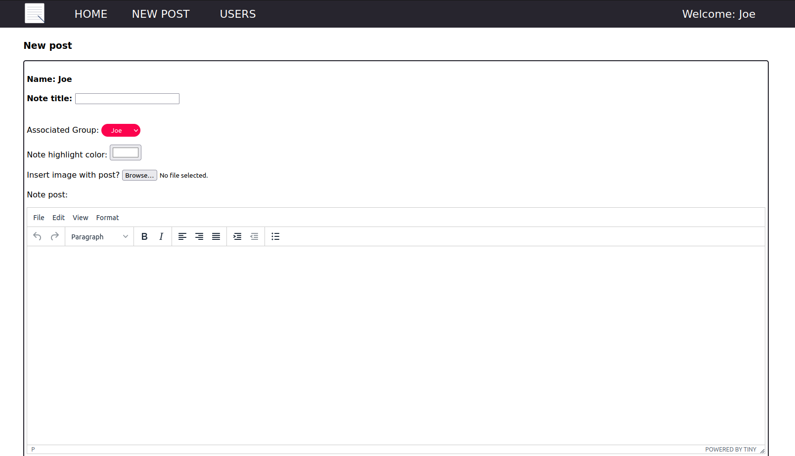

# OurNoteOrganizer

OurNoteOrganizer is a web-based note taking tool designed for small teams to use. It is built for non-Cloud, on-prem deployments and is paired with a Docker-Compose file for rapid deployment. 

The project first began as a proof-of-concept for exploring what can be done with PHP and MongoDB. To an extent, it still is a POC, as many features are still being developed or refined. This initial release is as much to gather community feedback as it is to share what could be a useful tool to certain teams. 

### Structure
OurNoteOrganizer is an interactive website that uses primarily HTML/PHP with a MongoDB backend to store data. A sample environment is provided using Docker and Docker Compose.

### Installation

The easiest way to begin using OurNoteOrganizer is to run a Git clone, then, using Docker and Docker Compose, run 'docker-compose up' in the main directory. This will auto install and run an Apache + PHP web environment along with another MongoDB environment. Parameters such as the DB password can be adjusted in the docker-compose.yml file as desired.

NOTE: If the DB password is adjusted, the login parameters in the web environment also need to be adjusted. This can be done by editing the mongologin.ini file:

    ip = mongo
    user = root
    pwd = mongopwd

Alternatively, for users looking to run in a more permenant environment using physical or virtual machines rather than containers, a LAMP stack with a MongoDB server can also be built. Just ensure that the MongoDB login parameters match those of the web environment's connection. 

Once running the containers without errors, navigate to the localhost or address/domain name of the host system. The home screen should appear. Default username is 'admin', password is also 'admin'. The password can be changed once logged in.

#### Run through: [https://www.youtube.com/watch?v=tx--3IZ9JIU](url)

#### Sercurity

To improve data security, MongoDB access should not be as I have in the reference code. 

Currently the login credentials are separated in mongologin.ini which gets read in header.php and applied to all the sub-pages.  ideally, the .ini file can be placed outside of the web server source (/var/www/html - Apache default), and on the server in a secure location with read-only access to the apache service user. Something like 'chown apache:apache mongologin.ini' would probably work in most Linux environments. Always be careful with access credentials.

### Basic use and organization

OurNoteOrganizer groups notes around the user/author and his/her associated groups or teams. All notes written are privy to the author and any associated groups he/she wishes to assign. Once multiple users are part of the same group all users are able to view and jointly edit / update the notes. 

The initial home page displays all notes available to the user; both his/her notes or notes where he/she is a group member. The posts are displayed as small squares with their assigned colors. Clicking 'VIEW' on any note allows for viewing the full note or article. 

The search bar at the top allows searching through the notes by associated group and post name.

New posts can be created simply by clicking the 'NEW POST' link on the top title bar. The author is bound to the logged in user. Post name, image, and highlight color can be defined, the associate group can be selected, and note content can be added.

To edit or update posts, users can click 'VIEW' and then 'EDIT POST'. If a color or image has been defined with the post a preview of each will be shown. When editing a post the original Author is kept as the source editor/author of the post regardless of who in the team is editing. This behavior may need to be adjusted in the future, but for now it is kept simple.

#### Uploading images

Each post or note can have an associated image included. All images appear in the top center of the post, and will also show at a smaller scale in the overview page (noteshome.php) and when editing a post. Changing the image will overwrite the original image association. 

<strong>Note: </strong>All image files will continue to exist on the server under the folder images even if changed. An area for future improvement could be to create a way to identify and remove unused images overtime, but for now is out-of-scope of this project.

##### Problems uploading images

Images are uploaded using an HTML POST to PHP which then moves the file from temporary storage to a permanent location in the 'images' directory. There are a couple of potential issues that could cause the file upload to fail. 

1. The directory permisions of the 'image' directory is not the correct permision level/ownership. On a production system with Apache running natively (i.e. VM or physical deployment) the best practice would be to run 'chown apache:apache images' for Debian/Ubuntu derivatives or 'chown httpd:httpd images' for RedHat derivatives. Per the Docker containers provided, running a volume passtrough can mean that the folder is running from a host that does not have the Apache user or group. For testing what has worked is running 'chmod 777 images' to allow write and execute access to the container. This method is probably not suitable for real production, but can work for those interested in playing with the project or can ensure a strong firewalled environment.

2. The file size may be simply too large to upload. In the Docker environment included, the default upload_max_filesize is 2 MB (this can be shown in the phpinfo.php page also included). To adjust this a user can change the config.ini files in PHP, but do so with caution and also bear in mind timeout time and other netwokring factors. This project is <strong>NOT</strong> designed to be a file upload service. 

### User and group management

Users and their associated groups can be adjusted in the 'USERS' section. Currently, only users who are labeled as Admins can adjust the user settings including the associated groups for each user, and add or delete users. Users can adjust their own passwords, however using the dropdown under the user name.

To create a new group, simply edit a user and add another group. <strong>Each group needs to be separated by a comma.</strong>

### Mongo Express

The docker-compose.yml file includes the parameters to also create a Mongo Express container that allows for easier management and debugging of the MongoDB environment. It is commented out as it can be a security risk if deployed 24/7 in a production environment. 

Mongo Express is a really handy tool to do fairly complex tasks with the MongoDB databases, but it requires no login if the credentials supplied in the Docker container are provided. Recommend using it when needed. 

I have found that the Mongo Express container can often fail to start if the MongoDB container is started at the same time. Based on what I have seen in the docker-compose start output, I believe this is due to the MongoDB container provisioning time takes longer and if it isn't ready to accept the Mongo Express connection, the Mongo Express container terminates. Simply running a 'docker start mongoex' command once the MongoDB container is fully running has proven a reliable work around. 

### A word on TinyMCE

TinyMCE is an external text editor which is used to help enhance the ease for writing and editing posts. It is an external tool that requires connectivity to external networks in order to function. For environments that do not have external Internet connectivity a standard textarea that does not offer rich formatting is employed. 

As this project is made to be hosted on any on-prem environment, there is no TinyMCE API key provided or registered. Users can create their own keys based on their domains and needs. To remove the notification about getting started, users can follow the quick steps, create their own API key, and add it to line 8 of the newpost.php file.

More information on TinyMCE and getting started: 

https://www.tiny.cloud/

https://www.tiny.cloud/docs/quick-start/

### SSL - Be Careful and Be Safe

Regardless of whether the deployment is on-prem or paired with a external WAN connection, SSL/TLS should be considered. It should be possible - though I have not tried during development - to install and run Let's Encrypt with Certbot on the container for quick and easy SSL set up. Users can also apply their own or trusted third-party SSL key to the Apache config files. If run in a different environment, i.e. NGINX, same rules apply. Please be careful with your data, and please use SSL if installing for anything else than a simple test environment that runs for a short amount of time each session.
